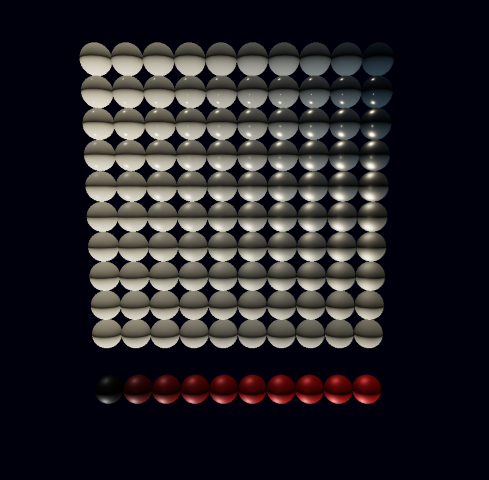

# Vulkan Engine

This repository contains a playground project by [Jonas](https://github.com/Shemnei), [Robin](https://github.com/Rob2309), and [Michael](https://github.com/michidk) to learn the Vulkan graphics API. It uses the [Rust language](https://www.rust-lang.org/) and the [Ash](https://github.com/MaikKlein/ash) Vulkan wrapper.

## Goal

The goal is to build a somewhat useable game engine and a demo using it. While we are probably never going to implement a fully-fledged engine, we try to make shortcuts to implement specific parts of it that we find interesting. It is more a learning project than anything else.

## Features

Currently implemented features are:
- BRDF rendering
- `.obj` parser
- Runs on both Linux and Windows
- Own math library (named `Crystal`)
- Custom shader format ([ve-shader](https://github.com/michidk/ve-shader))

## Screenshots

BRDF testing:

## Workspace

| Folder | Description | Readme |
| ---- | ----------- | - |
| `crystal` | A custom math library | [here](./crystal/README.md) |
| `ve_format` | Stores some shared structs | [here](./ve_format/README.md) |
| `ve_asset` | Utility that converts files into our custom format | [here](./ve_asset/README.md) |
| `vulkan-engine_derive` | Contains custom derive macros | None |
| `src` | Main engine library | This one |

## Examples

Examples are in the `/examples` folder. They can be run with `cargo +nightly run --example <name>`.
| Name | Description |
| ---- | ----------- |
| minimal | Displays a triangle using vertex colors |
| brdf | Renders using physically-based rendering |
| mesh | Loads and renders a custom mesh |

## Building

### Prerequisites

- [Rust](https://www.rust-lang.org/)
- [Vulkan SDK](https://www.lunarg.com/vulkan-sdk/)
- Optional: [Vulkan ValidationLayers](https://github.com/KhronosGroup/Vulkan-ValidationLayers)

You need our utility [ve-shader](https://github.com/michidk/ve-shader), which compiles our custom shader format. Install it with `cargo install ve_shader`. ve-shader in return requires [Python 2](https://www.python.org/), Git, cmake and ninja to run.

Compile the shaders with `make shaders`. Then build with `make build` or run an exmaple with `make run`.

## Resources

- [Vulkan Specs](https://www.khronos.org/registry/vulkan/specs/1.0/html/)
- [Vulkan Tutorial](https://vulkan-tutorial.com/Introduction)
- [Ask Documentation](https://docs.rs/ash/0.31.0/ash/)
