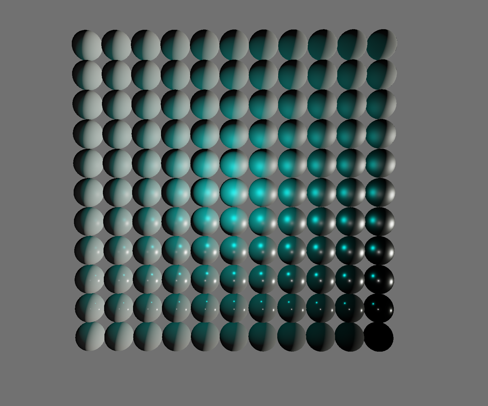
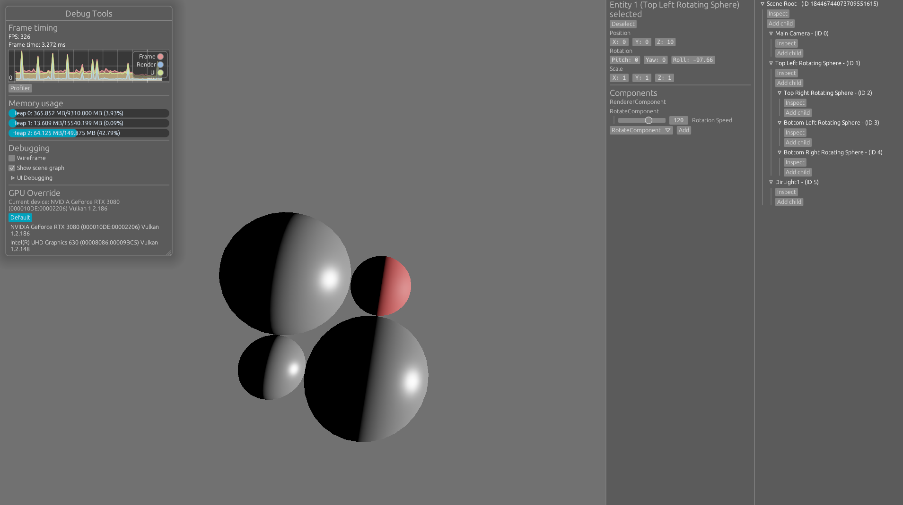

# Vulkan Engine

This repository contains a playground project by [Jonas](https://github.com/Shemnei), [Robin](https://github.com/Rob2309), and [Michael](https://github.com/michidk) to learn the Vulkan graphics API. It uses the [Rust language](https://www.rust-lang.org/) and the [Ash](https://github.com/MaikKlein/ash) Vulkan wrapper.

## Goal

The goal is to build a somewhat usable game engine and a demo using it. While we are probably never going to implement a fully-fledged engine, we will make shortcuts to implement specific parts of it that we find interesting. It is more a learning project than anything else.

## Features

Currently implemented features are:
- Scene comprised of Entities and Components
- Debug UI Layer with Frame stats, Scene Graph, Component Inspectors and Profiler
- BRDF shading
- Deferred rendering
- `.obj` parser
- Runs on both Linux and Windows

## Screenshots

BRDF testing:

Debug UI:

## Workspace

| Folder | Description | Readme |
| ---- | ----------- | - |
| [crates/engine](crates/engine) | Main engine library | This one |
| [crates/ve_asset](crates/ve_asset) | Utility that converts files into our custom format | [here](./crates/ve_asset/README.md) |
| [crates/ve_format](crates/ve_format) | Stores some shared structs | [here](./crates/ve_format/README.md) |
| [crates/ve_shader_reflect](crates/ve_shader_reflect) | Retrieves metadata from compiled shaders to feed into the material pipeline | [here](./crates/ve_shader_reflect/README.md) |

## Examples

Examples are in the [crates/engine/examples](crates/engine/examples) folder. They can be run with `cargo +nightly run --example <name>`.
| Name | Description |
| ---- | ----------- |
| minimal | Displays a triangle using vertex colors |
| brdf | Renders a couple of spheres using physically-based rendering |
| mesh | Loads and renders a custom mesh |
| textured_material | Creates a texture at runtime and renders it onto a quad |
| components | Shows off the engine's component system |

## Building

### Prerequisites

- [Rust](https://www.rust-lang.org/) (2021 Edition)
- [Vulkan SDK](https://www.lunarg.com/vulkan-sdk/) (at least v1.2.189.2)

Build with `make build` or run an example with `make run`.

## Resources

- [Vulkan 1.2 Specs](https://www.khronos.org/registry/vulkan/specs/1.2-khr-extensions/html/index.html)
- [Vulkan Tutorial](https://vulkan-tutorial.com/Introduction)
- [Ash Documentation](https://docs.rs/ash/0.33.3/ash/)
